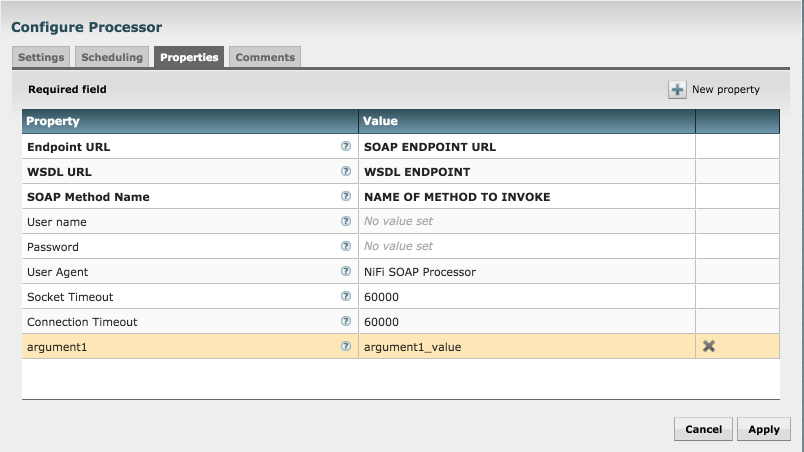

# nifi-soap

NiFi provenance reporting tasks.

## Table of Contents

- [Installation](#installation)
- [Configuration](#configuration)
    - [Required Properties]
    - [Configure Basic Auth]
    - [Optional Properties]
    - [Adding Method Arguments]
- [Todo](#todo)

## Installation

```sh
$ mvn clean package
$ cp nifi-soap-nar/target/nifi-soap-nar-0.0.1.nar $NIFI_HOME/lib
$ nifi restart
```

## Configuration



Figure 1.1

There are several configuration properties that must be configured to properly use this processor. Let's walk through each of them.

### Required Properties to configure
* **Endpoint URL** - This should be a valid URL for the SOAP endpoint you want to access

* **WSDL URL** - This should be the endpoint that contains the WSDL for the SOAP endpoint

* **SOAP Method Name** -- This should be the name of the SOAP method to be invoked


### Required Properties to configure for Basic Auth
If you are using Basic Authentication then the following two properties are also required:


* **User name** - The basic auth user name that should be used when invoking the SOAP method

* **Password** - The basic auth password that should be used when invoking the SOAP Method


### Optional Properties
The following properties are all optional
* User Agent - The User Agent string you want to use, the default is **NiFi SOAP Processor**

* Socket Timeout - This is the underlying timeout value used when trying to read from the socket. You should not have to change this.

* Connection Timeout - This is the timeout used when trying to establish a connection to the endpoint.


## Adding Method Arguments
If you are trying to invoke a SOAP method that takes arguments then you would add them as *New Properties* to the processor. In the figure 1.1 above, the property *argument1* is an example of adding a method argument. For each property added the name of the property will be used as the method name and the value of the property will be used as the value of the argument sent to the SOAP endpoint. Please keep in mind that there is no validation of the data that is entered into these dynamic properties.


## Todo

- Integrate other security mechanisms outside of Basic Auth
- Possibly add validation of XML that is returned
- Possibly support retrieving data that is not XML


## License

Copyright (c) 2016 Andrew Psaltis. nifi-soap is released under the Apache License Version 2.0.
